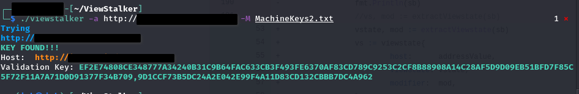

# Viewstalker
A tool for identifying and exploiting vulnerable view state implementations in ASP.NET 


### Background

View states are used in ASP.NET applications to preserve page and control values between round trips. View states may or may not be encrypted, and may or may not be signed using the machine authentication code (MAC) validation mechanism. Where MAC validation is implemented, deserialization on the backend is performed by [System.Web.UI.LosFormatter](https://docs.microsoft.com/en-us/dotnet/api/system.web.ui.losformatter?view=netframework-4.8) after [ObjectStateFormatter](https://learn.microsoft.com/en-us/dotnet/api/system.web.ui.objectstateformatter?view=netframework-4.8) has successfully verified the integrity of a given view state. [System.Web.UI.LosFormatter](https://docs.microsoft.com/en-us/dotnet/api/system.web.ui.losformatter?view=netframework-4.8) does not (and cannot) perform deserialization securely. As a result, an attacker with knowledge of an application's validation key (defined in `machine.config` or `web.config`) can achieve remote code execution on a vulnerable target by supplying a malicious gadget chain, like those generated by [ysoserial.net](https://github.com/pwntester/ysoserial.net). 

Despite the relative ease of exploitation, to my knowledge no utility exists to easily check large numbers of hosts for vulnerable implementations, and no utility at all exists to check hosts from Linux or OSX. It's not suprising therefore that this vulnerability remains fairly common in the wild. To address this I'm providing ViewStalker. Enjoy :) 

```
usage: viewstalker [-h|--help] [-l|--hosts <file>] [-M|--mac <file>]
                   [-a|--address "<value>"] [-v|--viewstate "<value>"] 
                   [-m|--modifier "<value>"] [-k|--no-check-cert]
                   

                   A tool for identifying vulnerable ASP.NET viewstates

Arguments:

  -h  --help           Print help information
  -l  --hosts          Path to file with list of hosts to check, one per line
  -M  --mac            machine keys file from blacklist3r
  -a  --address        Single host to check
  -v  --viewstate      b64 encoded __VIEWSTATE
  -m  --modifier       modifer
  -k  --no-check-cert  Disable TLS verification for use with mitm proxy etc


```




### TODO:
- [x] initial target handling and parsing
- [x] recreate blacklist3r functionality for bruting keys
- [x] Multi-host scanning
- [ ] automatic payload generation and exploitation
- [ ] Support for JSF view states

### Disclaimer

This software is intended to help security professionals find and remediate vulnerabilities stemming from reuse of publicly known machine keys. It is not intended to be used to attack systems except where explicitly authorized. Project maintainers are not responsible or liable for misuse of the software. Use responsibly.

In its current form, this software is not related with any company or organization, including those associated with the project maintainer or contributors.

### Acknowledgement 
[NotSoSecure](https://github.com/NotSoSecure)
[Soroush Dalili](https://soroush.secproject.com/blog/2019/04/exploiting-deserialisation-in-asp-net-via-viewstate/) 


### Bug Bounty 

I hack on the Synack platform. If you like the utility, please consider adding me as a contributor to your vulnerability reports ;) 

https://acropolis.synack.com/inductees/iek/ 
